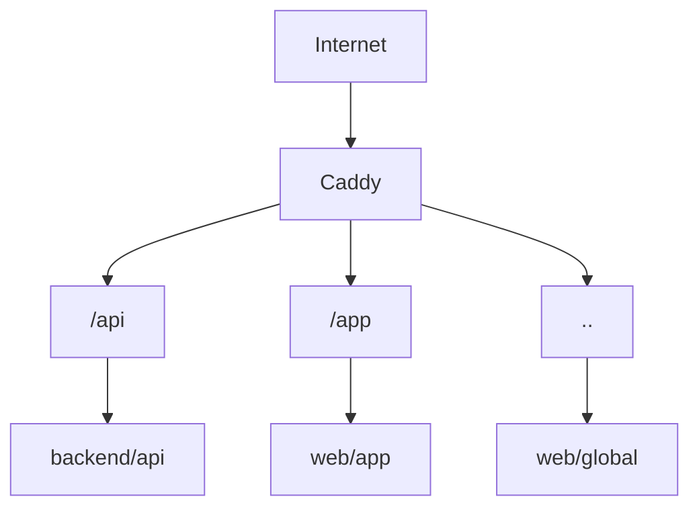

# 🔀 Router

A very simple Caddy reverse proxy. This allows us to deploy all our services behind the same domain avoiding CORS challanges

```mermaid
flowchart TD
    Internet --> Caddy
    Caddy --> /api
    Caddy --> /app
    Caddy --> ..
    /api --> backend/api
    /app --> web/app
    .. --> web/global
```
